# MANUAL TÉCNICO

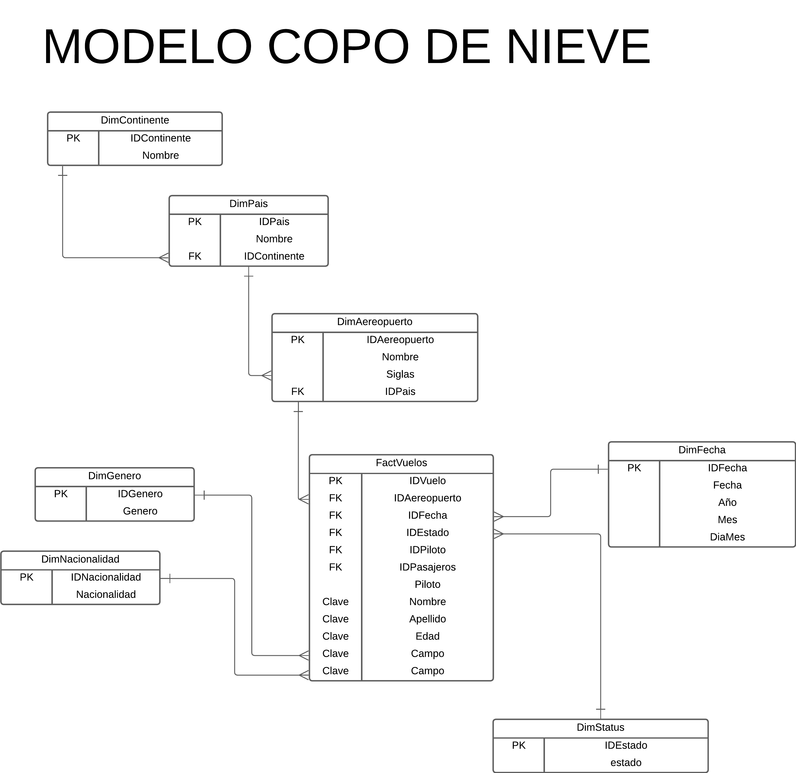 

Se utilizó un modelo de copo de nieve debido a que se normalizaron algunas tablas. Basado en la estructura de la base de datos y en los datos del archivo, se concluyó que el modelo de copo de nieve es óptimo. Aunque las consultas pueden ser más complejas en este modelo en comparación con el modelo estrella, se eligió el modelo de copo de nieve para garantizar la persistencia de datos y evitar la incoherencia o duplicación de datos en la base de datos.

### Tablas de Dimensiones

#### Dimension Aereopuerto

Tabla para guardar los aereopuertos

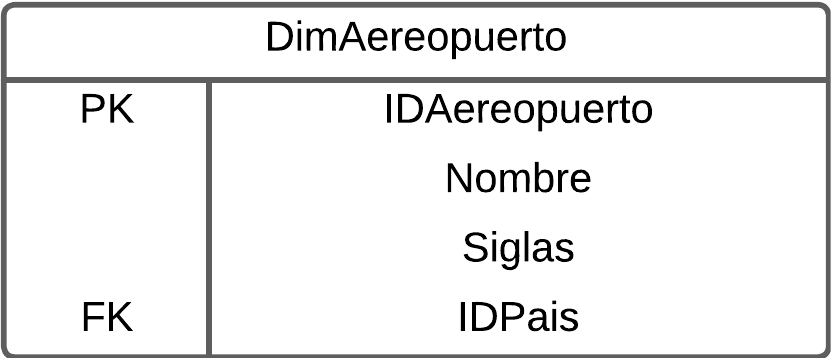
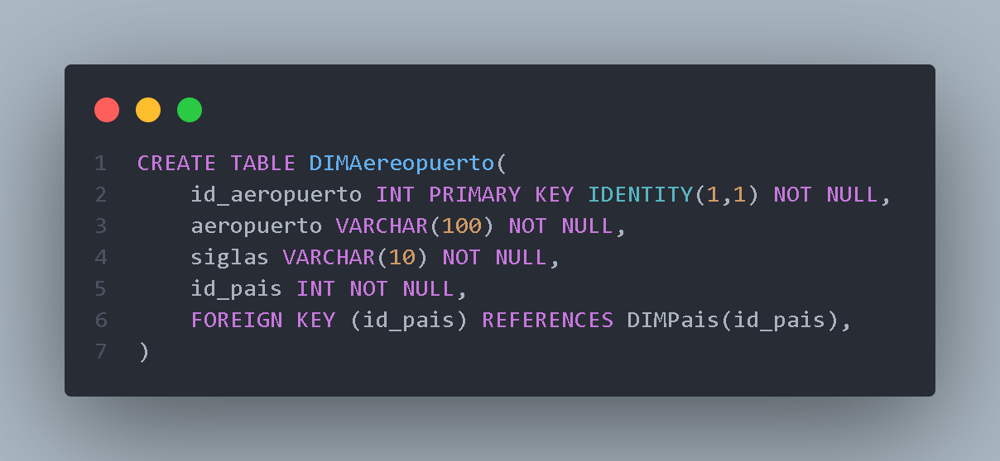

#### Dimension Continente

Tabla para almacenar los continentes

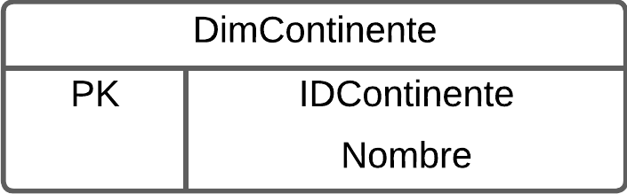
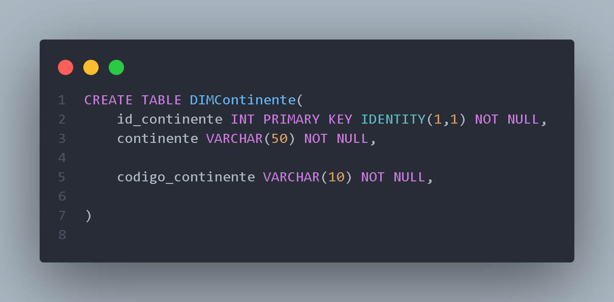

#### Dimension Fecha
Tabla para almacenar las fechas de los vuelos

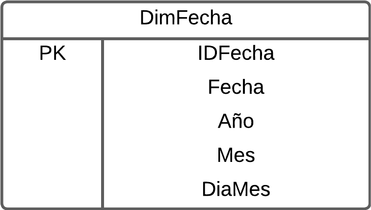
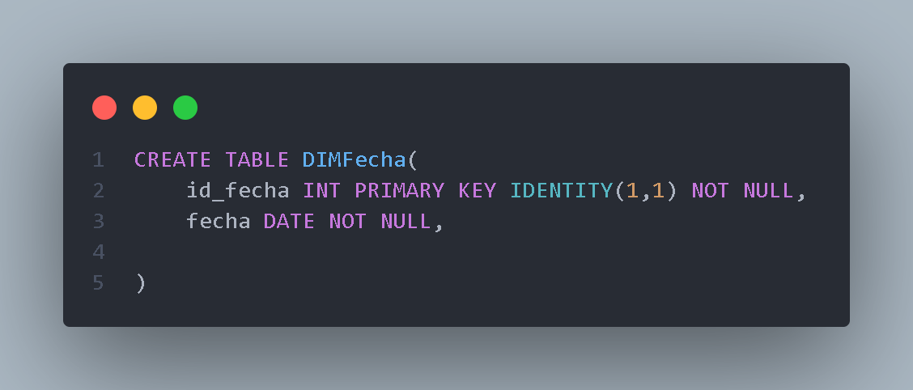

#### Dimension Genero

Tabla para almacenar el genero de una persona 

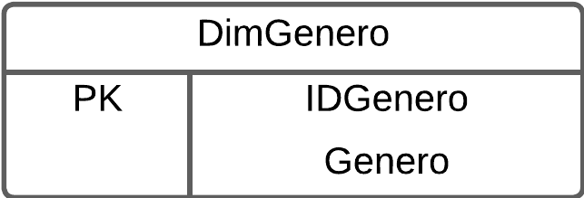

#### Dimension Nacionalidad
Tabl para almacenar la nacionalidad de una persona

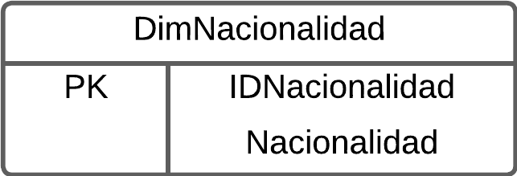
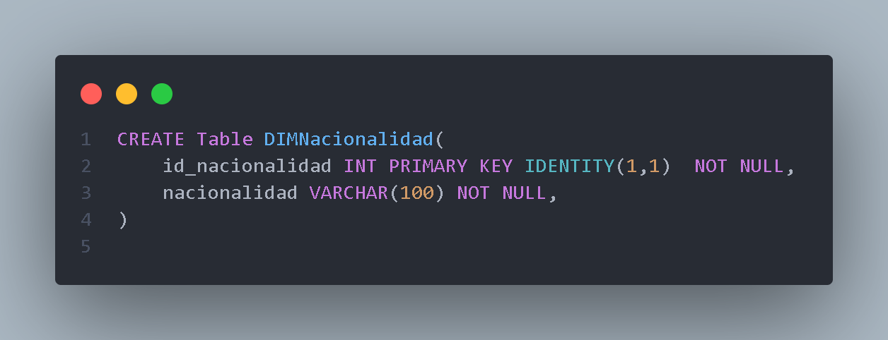

#### Dimension Pais
Tabla para almacenar el pais de un vuelo

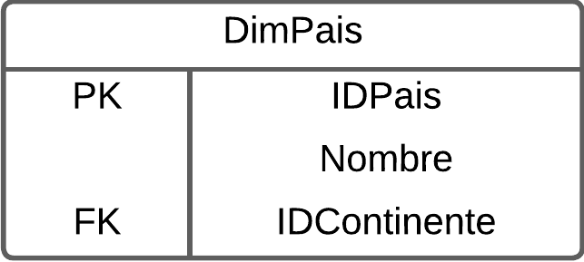
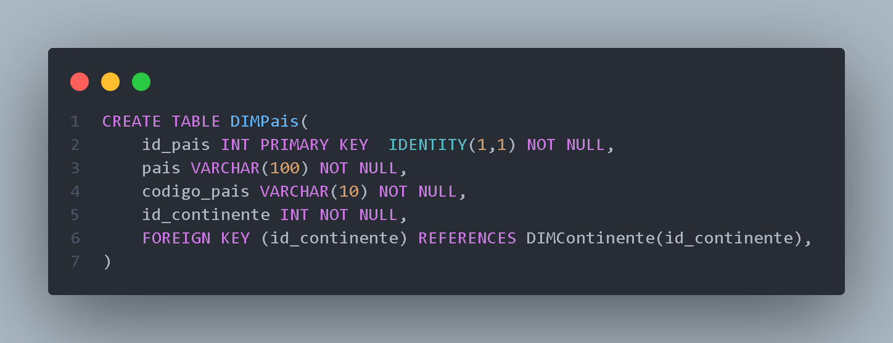

#### Dimension Estado
Tabla para almacenar el estado de un vuelo

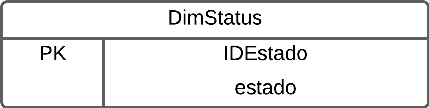
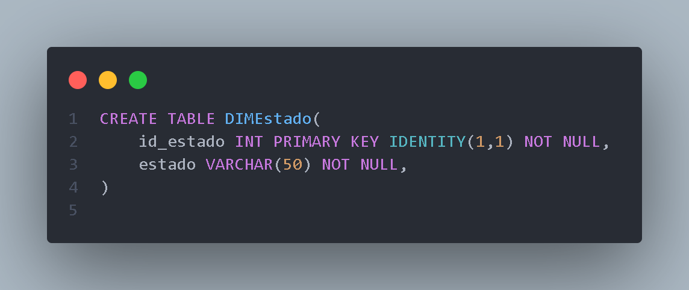

## Tabla de Hechos

#### Hechos Vuelos
Tabla de hechos unica, en la cual se hace referencia a todas las dimensiones.

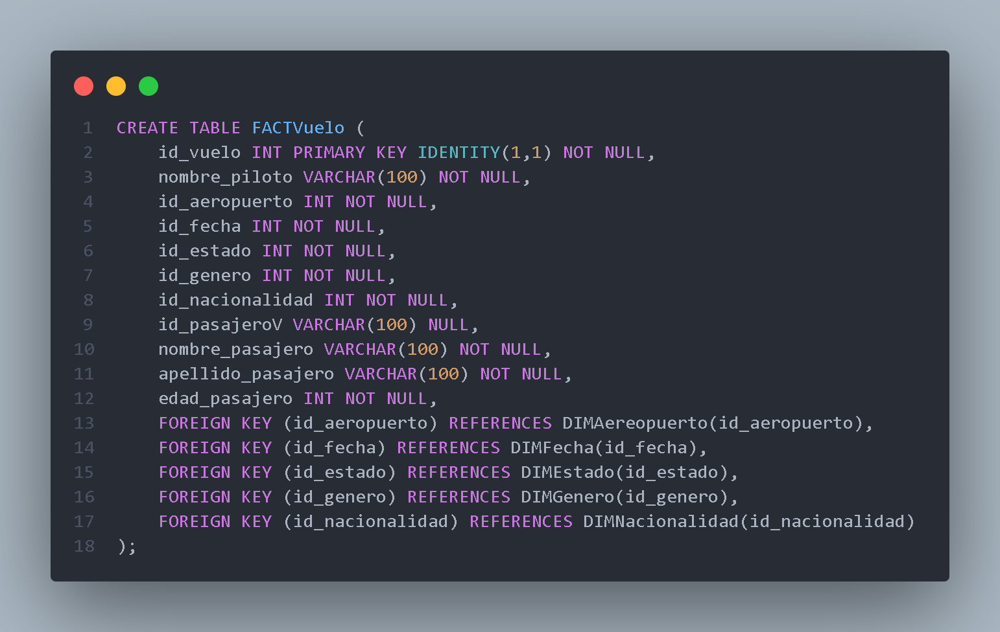

